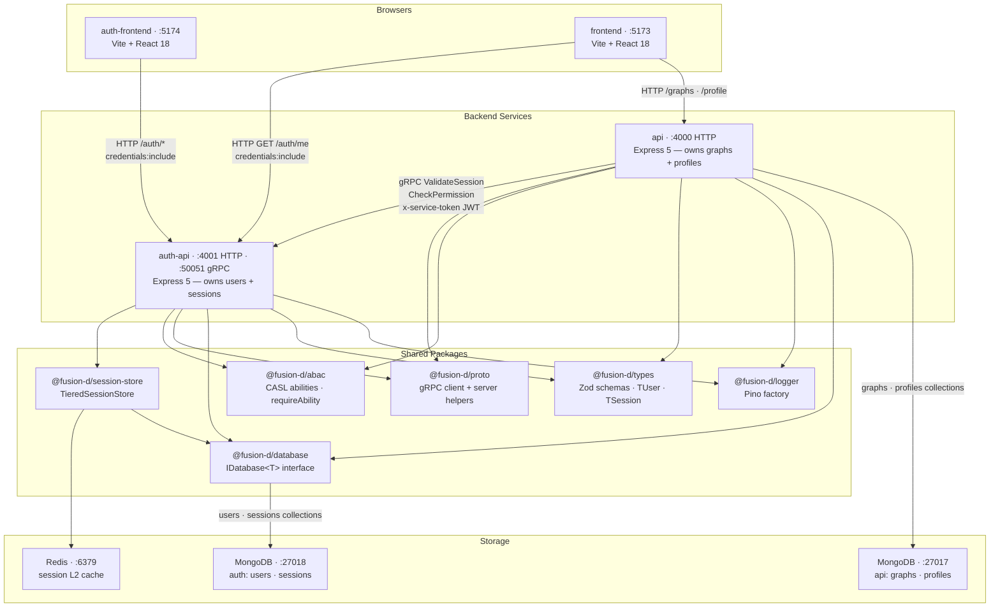
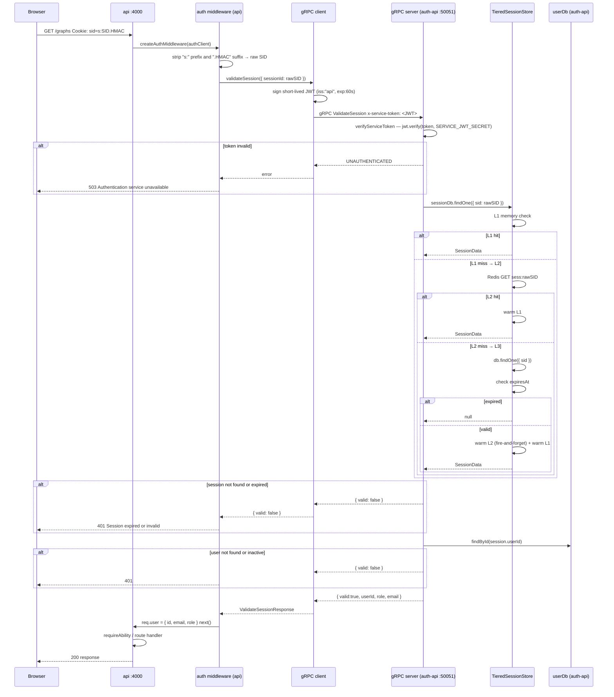

# Architecture Overview

## Service Map

The following diagram shows every Fusion-D service, shared package, and storage backend that participates in authentication or authorization, and the connections between them.

Key observations:
- `auth-api` is the **only** service that reads or writes user records and session records. `api` never queries those databases directly.
- `api` delegates **all** identity verification to `auth-api` via gRPC on every request. There is no local token cache in `api`.
- `frontend` calls `/auth/me` on `auth-api` (not on `api`) to establish user identity for the UI.
- The session store is a package owned entirely by `auth-api`; `api` never touches it.

---

## Auth-Specific Data Flow

The sequence below shows what happens when a browser with a valid session cookie makes a request to a protected `api` route. This is the most complete path through the auth system.

---

## Technology Table

| Package / Library | Role in the auth system | Source |
|---|---|---|
| **Express 5** | HTTP server for `auth-api` and `api` | `apps/auth-api/`, `apps/api/` |
| **express-session** | Session middleware — manages cookie lifecycle and delegates storage to `TieredSessionStore` | `apps/auth-api/src/server.ts` |
| **argon2** | Password hashing (argon2id, memoryCost 64 MB, timeCost 3, parallelism 4) | `apps/auth-api/src/routes/auth.ts` |
| **helmet** | HTTP security headers (CSP, X-Frame-Options, etc.) | `apps/auth-api/src/middleware/security.ts` |
| **cors** | Explicit-origin allowlist; `credentials:true` for cookie forwarding | `apps/auth-api/src/middleware/security.ts` |
| **express-rate-limit** | Per-IP rate limiting on login (10/15 min), register (5/hr), and general routes (100/min) | `apps/auth-api/src/middleware/security.ts` |
| **@grpc/grpc-js + @grpc/proto-loader** | gRPC transport — `auth-api` serves, `api` calls | `packages/proto/` |
| **jsonwebtoken** | Signs and verifies the `x-service-token` JWT for service-to-service gRPC calls | `apps/api/src/grpc/client.ts`, `apps/auth-api/src/grpc/server.ts` |
| **@casl/ability** | Attribute-based access control — ability definitions keyed by user role | `packages/abac/` |
| **lru-cache** | In-process L1 session cache (≤60 s TTL, 1 000-item LRU) | `packages/session-store/src/layers/memory.ts` |
| **ioredis** | L2 session cache (Redis, 24 h TTL, graceful degradation) | `packages/session-store/src/layers/redis.ts` |
| **mongoose** | MongoDB ODM for user and session persistence in production | `apps/auth-api/src/server.ts` |
| **zod** | Runtime schema validation for env config, request bodies, and domain types | `packages/types/`, `apps/auth-api/src/config.ts` |
| **@tanstack/react-query** | Client-side data fetching; drives AuthGuard session check | `apps/auth-frontend/`, `apps/frontend/` |
| **react-router-dom v6** | Client-side routing for auth-frontend pages | `apps/auth-frontend/src/App.tsx` |
| **pino** | Structured JSON logging; redacts `password`, `token`, `secret`, `cookie` | `packages/logger/` |
| **Vite** | Dev server and bundler for both React frontends | `apps/auth-frontend/`, `apps/frontend/` |
| **tsup** | Bundles shared packages to ESM with `.d.ts` declarations | All `packages/*/tsup.config.ts` |
| **Turborepo** | Orchestrates build/dev/test tasks across the monorepo in dependency order | `turbo.json` |
| **pnpm workspaces** | Links internal packages via `workspace:*` protocol | `pnpm-workspace.yaml` |
