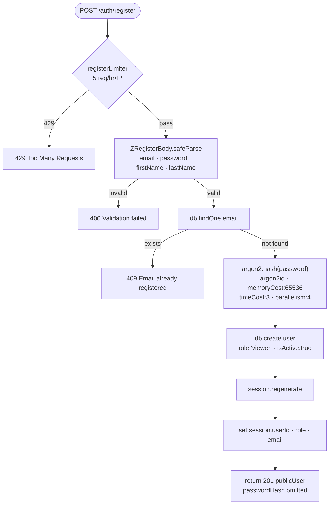
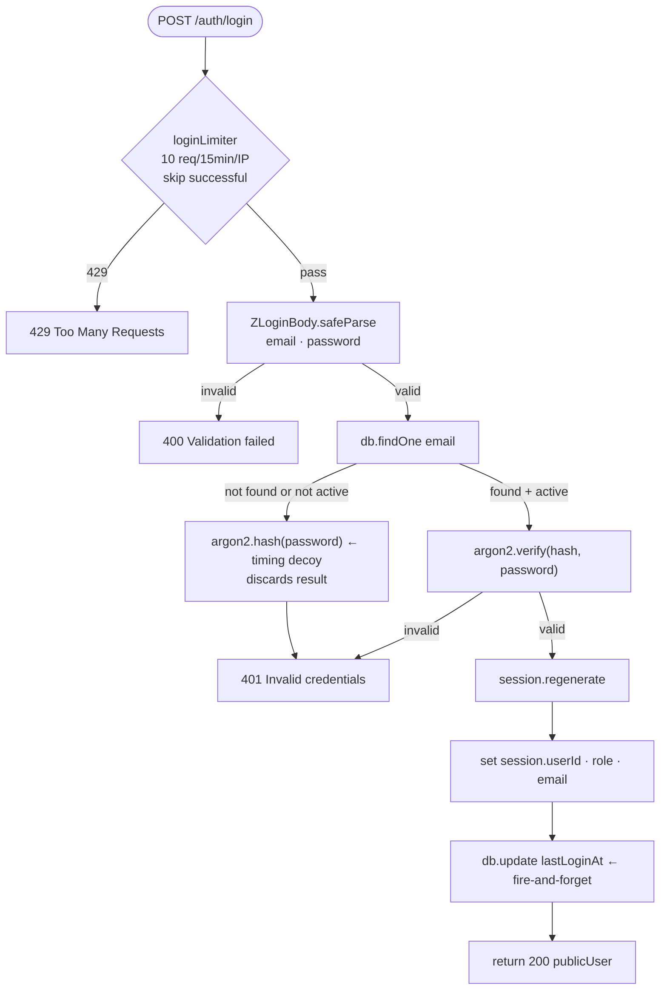
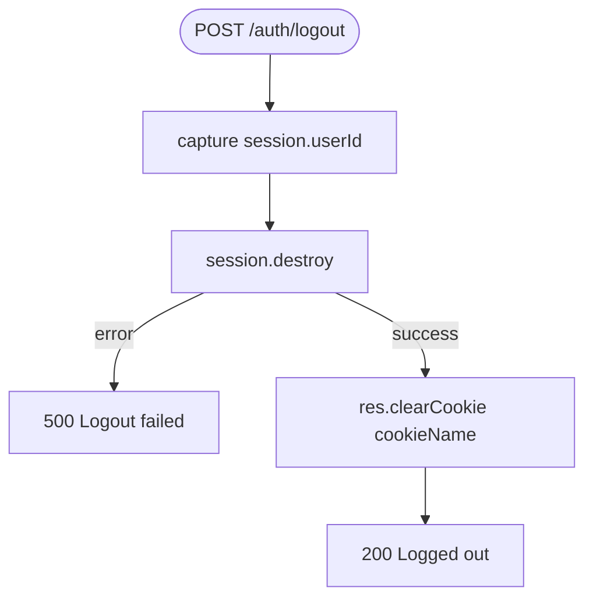
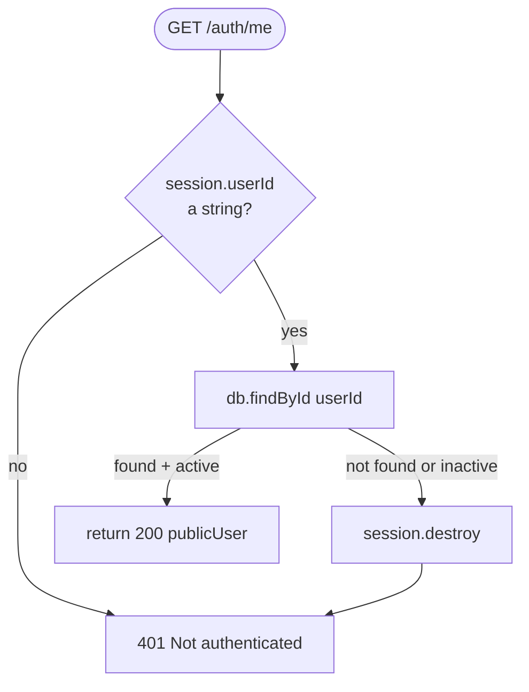

# Authentication Flows

All authentication is handled by `apps/auth-api/src/routes/auth.ts`. The router is mounted at `/auth` and receives five routes: `POST /register`, `POST /login`, `POST /logout`, `GET /me`, and `POST /refresh`.

---

## Security Middleware Chain

Before any request reaches a route handler, it passes through a fixed middleware stack defined in `apps/auth-api/src/server.ts` and `apps/auth-api/src/middleware/security.ts`.

**Execution order on every incoming request:**

1. `express.json()` — parses JSON bodies (limit: 1 MB)
2. `express.urlencoded()` — parses form bodies (limit: 1 MB)
3. `helmet()` — sets security headers: strict CSP (`default-src 'self'`), no iframes, no object embeds
4. `cors()` — checks `Origin` against `ALLOWED_CORS_ORIGINS`; rejects unlisted origins with an error; allows no-origin requests (same-origin, curl)
5. `generalLimiter` — 100 requests/minute/IP across all routes
6. `session()` — resolves the session from `TieredSessionStore` and populates `req.session`
7. Route-specific middleware (e.g., `loginLimiter`, `registerLimiter`) — applied per route before the handler

> **Security:** CORS is configured with `credentials: true` so that the browser includes the session cookie on cross-origin requests. An allowlist (not a wildcard) is enforced even in development. Widening `ALLOWED_CORS_ORIGINS` to `*` would break cookie forwarding entirely because `credentials: true` is incompatible with `origin: *`.

---

## Registration Flow



**Input:** `{ email, password (12–128 chars), firstName, lastName }`

**Output:** `201 { user: TPublicUser }` — the full user record minus `passwordHash`.

> **Security:** `session.regenerate()` is called before writing any user data to the session. This invalidates the pre-login session ID and issues a new one, preventing session fixation attacks. See `apps/auth-api/src/routes/auth.ts:57–59`.

---

## Login Flow



**Input:** `{ email, password }`

**Output:** `200 { user: TPublicUser }` on success; `401 { error: "Invalid credentials" }` on any failure.

> **Security — timing-safe decoy:** When the user is not found or is inactive, the handler still calls `argon2.hash(password, ARGON2_PARAMS)` and discards the result (`apps/auth-api/src/routes/auth.ts:88`). This ensures the response time for a nonexistent account matches the time for an account with a wrong password, preventing username enumeration via timing.

> **Security — session fixation:** `session.regenerate()` is called on successful login (same as registration), issuing a new session ID before writing the authenticated identity.

---

## Logout Flow



`session.destroy()` propagates to all three store layers: `MemoryLayer.delete()` runs synchronously, then `Promise.allSettled([redis.delete(), db.delete()])` runs — both must settle before the callback fires. The cookie is cleared on the response regardless of which backend layers succeeded.

---

## Session Verification — /auth/me



This route does **not** require any body. It uses the existing session cookie. The database lookup confirms the user still exists and is active — a user could be deactivated after their session was created.

---

## Session Refresh — /auth/refresh

`POST /auth/refresh` has no body. It checks `session.userId` is present, then calls `req.session.touch()`. With `rolling: true` already set in the session middleware, every authenticated request extends the TTL automatically; this endpoint exists for clients that want to extend the session explicitly without making a real request.

---

## Endpoint Reference

| Method | Path | Rate Limit | Request Body | Success Response | Key Error Responses |
|---|---|---|---|---|---|
| `POST` | `/auth/register` | 5/hr/IP | `{ email, password, firstName, lastName }` | `201 { user: TPublicUser }` | `400` validation · `409` duplicate email · `429` rate limited |
| `POST` | `/auth/login` | 10/15min/IP (skip success) | `{ email, password }` | `200 { user: TPublicUser }` | `400` validation · `401` invalid credentials · `429` rate limited |
| `POST` | `/auth/logout` | 100/min (general) | — | `200 { message: "Logged out" }` | `500` destroy error |
| `GET` | `/auth/me` | 100/min (general) | — | `200 { user: TPublicUser }` | `401` not authenticated |
| `POST` | `/auth/refresh` | 100/min (general) | — | `200 { message: "Session refreshed" }` | `401` not authenticated |

**TPublicUser shape** (`packages/types/src/user.ts`):

```typescript
{
  id: string
  email: string
  firstName: string
  lastName: string
  role: 'admin' | 'editor' | 'viewer'
  isActive: boolean
  lastLoginAt?: Date
  createdAt: Date
  updatedAt: Date
  image?: string
  profile?: TUserProfile
}
// passwordHash is always omitted
```

All routes require `Content-Type: application/json` and `credentials: 'include'` from the browser so the session cookie is forwarded.

---

## Session Cookie

The cookie is configured in `apps/auth-api/src/server.ts`:

```typescript
cookie: {
  httpOnly: true,                              // not accessible from JS
  secure: config.NODE_ENV === 'production',    // HTTPS only in production
  sameSite: 'strict',                          // no cross-site submission
  maxAge: config.SESSION_TTL_SECONDS * 1000,   // default: 86 400 000 ms (24 h)
}
```

`rolling: true` means the `maxAge` is reset on every response that touches the session. The cookie name defaults to `sid` and is configurable via `SESSION_COOKIE_NAME`.

`express-session` signs the cookie value using `SESSION_SECRET`, producing `s:SID.HMAC`. The raw session ID (used for store lookups) is `SID` — the `s:` prefix and `.HMAC` suffix are stripped before any lookup.
