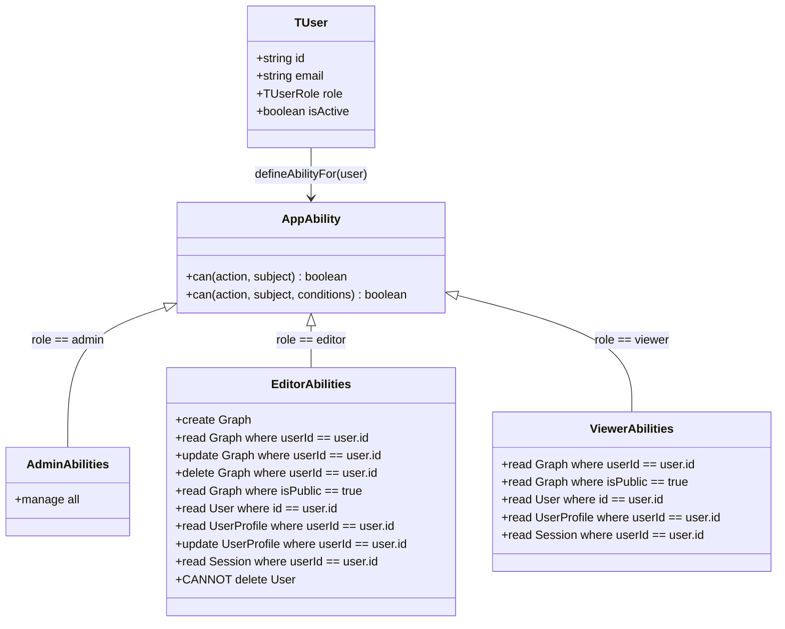
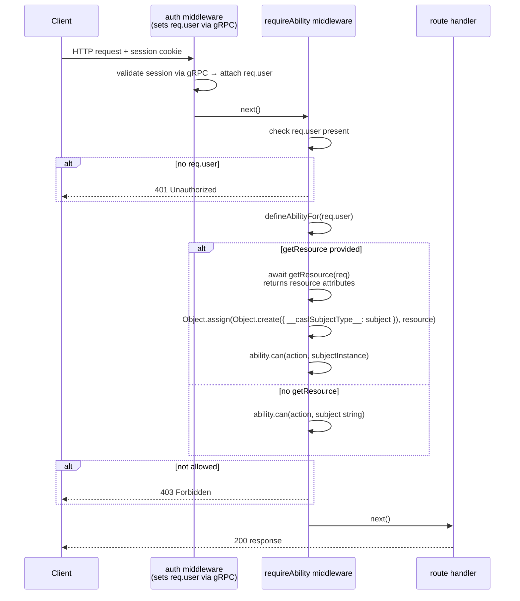

# Authorization — Attribute-Based Access Control

## What ABAC Is and How CASL Implements It Here

ABAC (Attribute-Based Access Control) grants or denies access based on attributes of the **user**, the **resource**, and the **action** — not just on a flat role name. This is distinct from simple RBAC where "editor can edit" is a blanket rule. In Fusion-D, an editor can update a Graph, but only if `graph.userId === user.id`. The attribute (`userId`) is part of the rule.

[CASL](https://casl.js.org/) implements ABAC by letting you define a set of **abilities** — `can(action, subject, conditions)` tuples — and then asking `ability.can(action, resource)` at runtime. Conditions are plain MongoDB-style query objects applied against the resource's attributes.

All ABAC logic lives in `packages/abac/`.

---

## Ability Model

The diagram below models the full ability set derived from `packages/abac/src/ability.ts`.



`defineAbilityFor(user: TUser): AppAbility` is the single function that produces abilities from a user object. It is called:
- Inside `requireAbility` middleware on every protected HTTP request in `api`.
- Inside `checkPermission` in `packages/abac/src/ability.ts` when called from the gRPC `CheckPermission` handler in `auth-api`.

The ability type is:

```typescript
// packages/abac/src/ability.ts
type AppAction = 'create' | 'read' | 'update' | 'delete' | 'manage'
type AppSubject = 'Graph' | 'User' | 'UserProfile' | 'Session' | 'all'
                | TGraph | TUser | TUserProfile | TSession
type AppAbility = MongoAbility<[AppAction, AppSubject]>
```

---

## Middleware Enforcement Chain

The following sequence shows what happens when `requireAbility('update', 'Graph', getResource)` is applied to an incoming request.



**How it is used in practice:**

```typescript
// No resource check — any authenticated editor can create a Graph
router.post('/graphs', authMiddleware, requireAbility('create', 'Graph'), handler)

// Ownership check — editor can only update their own Graph
router.patch(
  '/graphs/:id',
  authMiddleware,
  requireAbility('update', 'Graph', async (req) => {
    const graph = await graphDb.findById(req.params.id)
    return { userId: graph?.userId, isPublic: graph?.isPublic }
  }),
  handler,
)
```

The `getResource` function returns a plain attribute object. CASL evaluates the conditions (e.g., `{ userId: user.id }`) against these attributes. The `__caslSubjectType__` prototype property tells CASL which subject string to use for the lookup.

---

## The `checkPermission` Function

`checkPermission` (`packages/abac/src/ability.ts:66`) is a non-Express version of the same check. It is called by the gRPC `CheckPermission` handler in `apps/auth-api/src/grpc/server.ts` when `api` needs to verify a permission without an HTTP context:

```typescript
const allowed = checkPermission(
  effectiveUser,      // TUser fetched from DB — DB is authoritative, not the token role
  action as AppAction,
  subject as AppSubject,
  resource,           // Record<string, unknown> from gRPC resourceAttributes map
)
```

> **Security:** The gRPC `CheckPermission` handler re-fetches the user from the database rather than trusting the `role` field from the incoming request. The DB is the authoritative source for the user's current role. See `apps/auth-api/src/grpc/server.ts:62`.

---

## Where Authorization Is Checked

| Check point | What runs | Where |
|---|---|---|
| HTTP request to `api` — identity | `createAuthMiddleware` → gRPC `ValidateSession` | `apps/api/src/middleware/auth.ts` |
| HTTP request to `api` — permission | `requireAbility(action, subject, getResource?)` | Per-route in `apps/api/src/` routes |
| gRPC call from `api` to `auth-api` | `addAuthService` token interceptor | `packages/proto/src/server.ts` |
| gRPC `CheckPermission` RPC | `checkPermission(user, action, subject, resource)` | `apps/auth-api/src/grpc/server.ts` |
