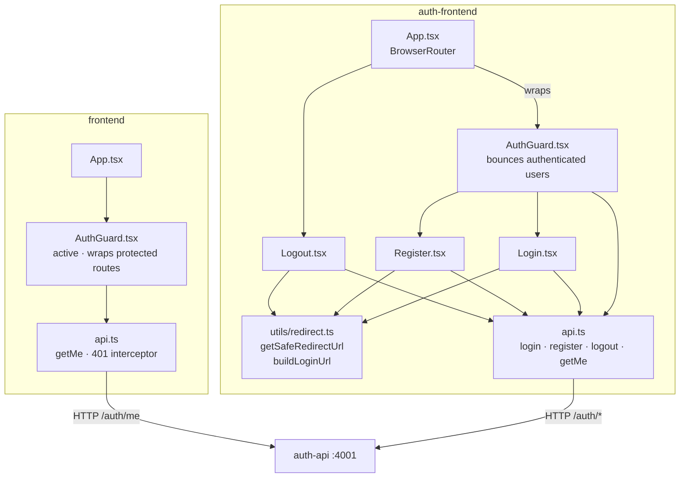
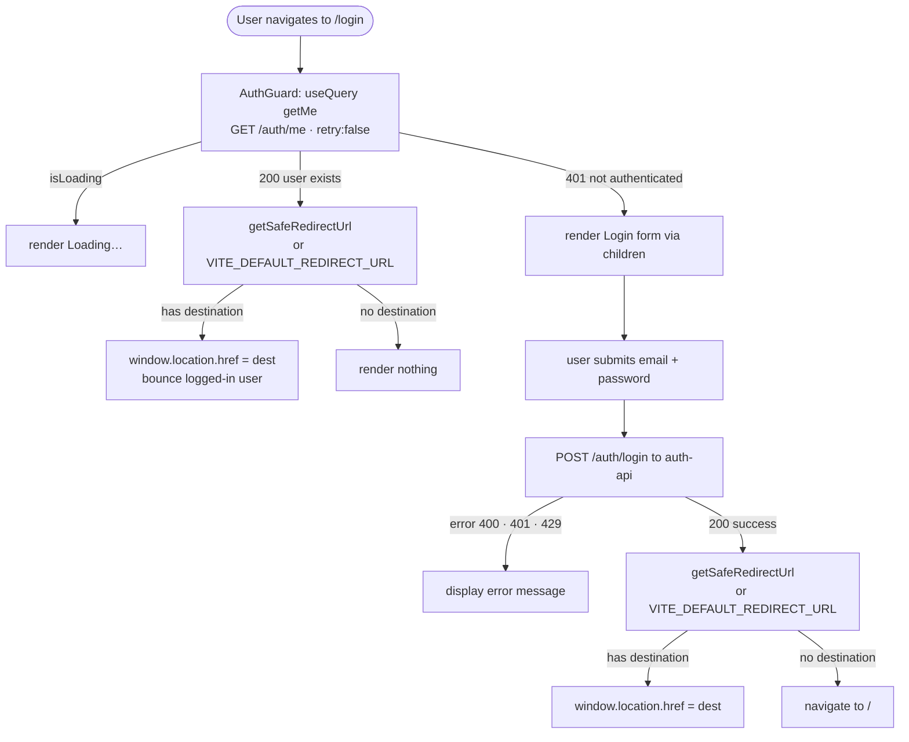
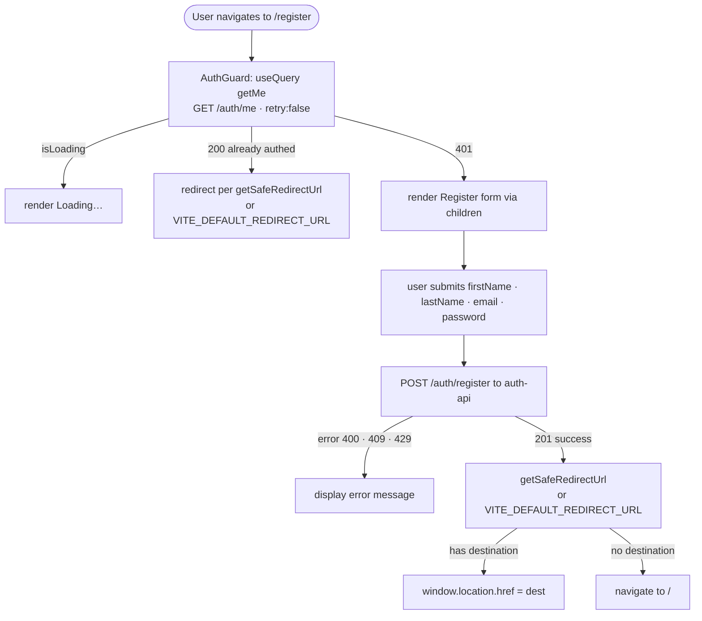
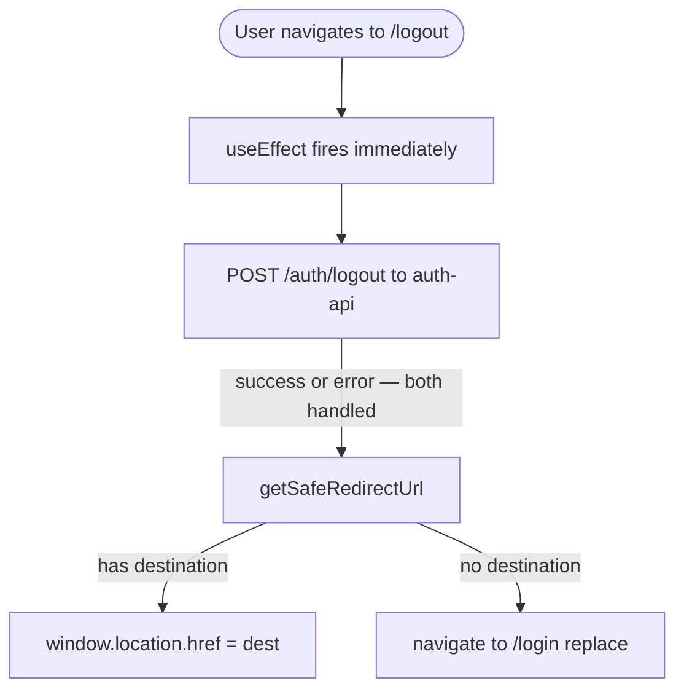
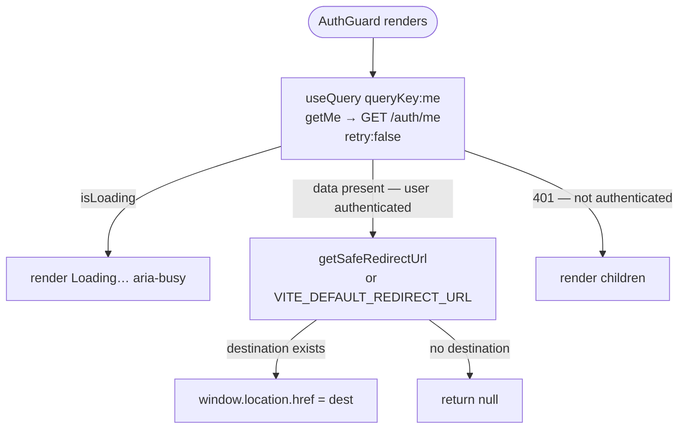
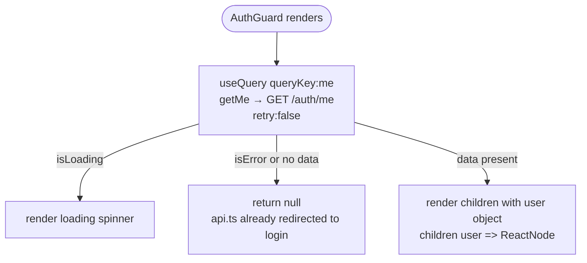

# Frontend Auth Flows

Fusion-D has two frontends with different auth responsibilities:

- **`auth-frontend` (:5174)** — the authentication SPA. Hosts login, register, and logout pages. Has no protected content of its own; it exists solely to authenticate users and redirect them onward.
- **`frontend` (:5173)** — the main application SPA. Contains protected content. Delegates all authentication decisions to `auth-api` and redirects unauthenticated users to `auth-frontend`.

---

## Two AuthGuard Components — Opposite Roles

This is an important architectural distinction. Both frontends have a component called `AuthGuard`, but they enforce opposite invariants.

| | `auth-frontend` AuthGuard | `frontend` AuthGuard |
|---|---|---|
| **File** | `apps/auth-frontend/src/components/AuthGuard.tsx` | `apps/frontend/src/components/AuthGuard.tsx` |
| **Invariant** | If you **are** authenticated → redirect away | If you **are not** authenticated → block and redirect to login |
| **Use case** | Bounce already-logged-in users off auth pages | Gate protected app pages |
| **Children** | Renders children (the auth form) only when NOT authenticated | Renders children (the app content) only when authenticated; passes `user` object |
| **Redirect target** | `VITE_DEFAULT_REDIRECT_URL` or `?redirect` param | `auth-frontend/login?redirect=<current URL>` (via `api.ts` interceptor) |
| **Status in router** | **Active** — wraps `/login` and `/register` in `App.tsx` | **Active** — wraps all protected routes |

---

## Component Map



---

## Login Flow

`AuthGuard` runs first on every render of `/login`. It calls `GET /auth/me` and redirects authenticated users before the login form ever appears.



The `?redirect` query param is read from the URL by `getSafeRedirectUrl()` and validated against `VITE_ALLOWED_REDIRECT_ORIGINS` before any redirect is followed (see [Open Redirect Defense](#open-redirect-defense) below).

---

## Register Flow



Password minimum length (12 characters) is enforced both client-side (`minLength={12}` on the input) and server-side (`ZRegisterBody` schema in `@fusion-d/types`).

---

## Logout Flow



The logout page renders "Signing out…" and calls the API in a `useEffect`. Errors from the logout call are swallowed (`.catch(() => null)`) because the session may already be invalid, and the user should be redirected regardless. `navigate('/login', { replace: true })` prevents the logout page from appearing in browser history.

`/logout` is **not** wrapped by `AuthGuard` — the logout route must be reachable regardless of auth state.

---

## auth-frontend AuthGuard



`retry: false` prevents TanStack Query's default three-retry behavior on a 401, which would add ~3 seconds of delay before the form appears.

The guard is mounted as a **children wrapper** in `App.tsx`:

```tsx
<Route path="/login"    element={<AuthGuard><Login /></AuthGuard>} />
<Route path="/register" element={<AuthGuard><Register /></AuthGuard>} />
```

Any future auth page (e.g. `/forgot-password`) gets the same protection by adding it under `<AuthGuard>` — no per-page hook call required.

---

## frontend AuthGuard (Protected Routes)



The `frontend` `AuthGuard` uses a **render prop** pattern: `children` is a function that receives the authenticated `AuthUser`. This guarantees that any child component always has a non-null user object — no downstream null checks needed.

The redirect on 401 happens inside `apps/frontend/src/api.ts`, not inside `AuthGuard` itself:

```typescript
// apps/frontend/src/api.ts
if (res.status === 401) {
  window.location.href = `${AUTH_FRONTEND}/login?redirect=${encodeURIComponent(window.location.href)}`
  return new Promise(() => undefined) // never resolves — page navigating away
}
```

When `getMe` returns a 401, the fetch wrapper redirects the entire page to `auth-frontend/login?redirect=<current URL>`. By the time `AuthGuard` receives `isError: true`, the browser is already navigating away. `AuthGuard` returns `null` as a clean fallback.

---

## Open Redirect Defense

`apps/auth-frontend/src/utils/redirect.ts` contains the `getSafeRedirectUrl()` function, which validates the `?redirect` query param before any redirect is performed.

**Validation rules:**

1. If there is no `?redirect` param → return `null`.
2. If the value is a valid absolute URL → check that its `origin` matches one of the entries in `VITE_ALLOWED_REDIRECT_ORIGINS`. If not allowed → return `null`.
3. If the value is not a valid URL (i.e., `new URL()` throws) → allow only if it starts with `/` (safe relative path). Anything else → return `null`.

```typescript
// apps/auth-frontend/src/utils/redirect.ts
export function getSafeRedirectUrl(): string | null {
  const params = new URLSearchParams(window.location.search)
  const redirect = params.get('redirect')
  if (!redirect) return null
  try {
    const url = new URL(redirect)
    const isAllowed = ALLOWED_ORIGINS.some((origin) => {
      try { return new URL(origin).origin === url.origin } catch { return false }
    })
    return isAllowed ? redirect : null
  } catch {
    return redirect.startsWith('/') ? redirect : null
  }
}
```

`buildLoginUrl(redirectTo?)` in the same file constructs the login URL with the `?redirect` param properly `encodeURIComponent`-encoded. Use this function anywhere you need to send a user to the login page with a return destination.

> **Security:** `VITE_ALLOWED_REDIRECT_ORIGINS` is a comma-separated list of allowed origins (e.g. `http://localhost:5173,https://app.example.com`). An empty list means all absolute-URL redirects are blocked — only relative paths starting with `/` are allowed. This must be explicitly configured; there is no default that allows any external origin.

---

## API Client — auth-frontend

`apps/auth-frontend/src/api.ts` is a thin fetch wrapper. All requests include `credentials: 'include'` so the session cookie is sent and received across the origin boundary. The base URL is `VITE_AUTH_API_URL` (e.g. `http://localhost:4001`). There is no retry logic and no 401 interceptor — auth pages are not protected routes and a 401 is expected for unauthenticated users.
