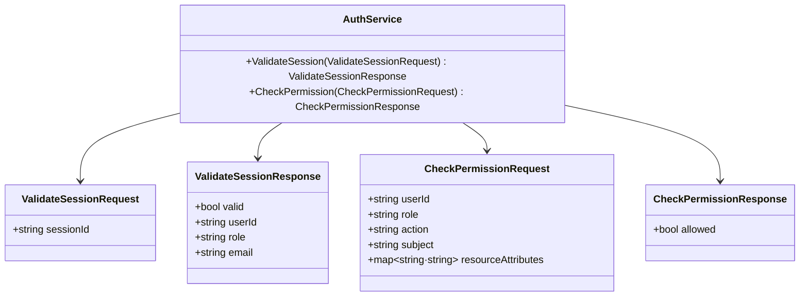
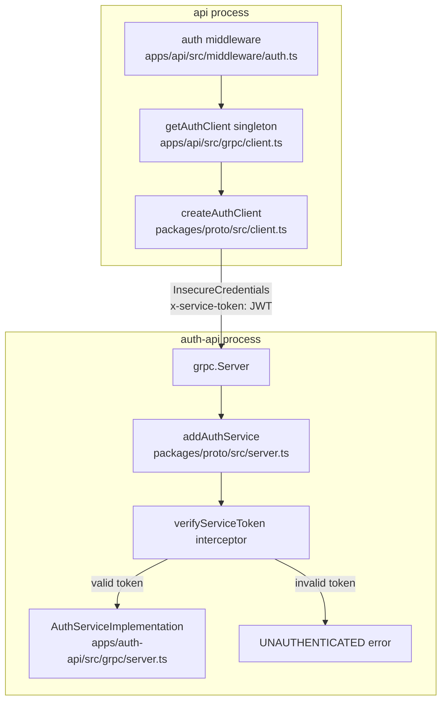
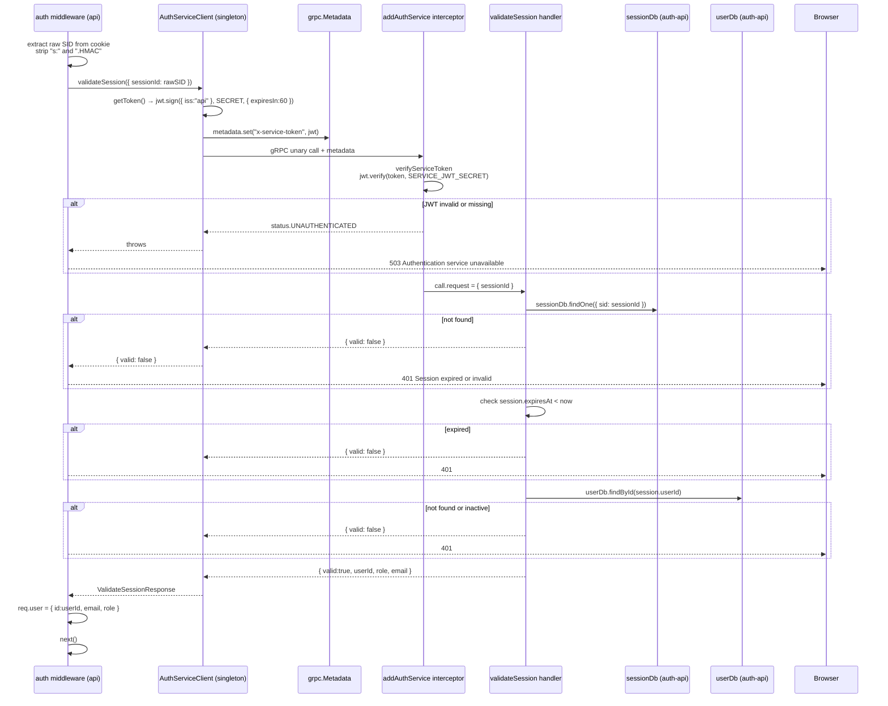

# gRPC Contract

## Proto Definition

The entire service contract lives in `packages/proto/proto/auth.proto`. It is reproduced in full below — this file is the source of truth for both the client (`api`) and the server (`auth-api`).

```protobuf
syntax = "proto3";

package auth;

option java_package = "com.fusiond.auth";
option java_outer_classname = "AuthProto";

service AuthService {
  // Validates a session ID and returns the associated user info
  rpc ValidateSession(ValidateSessionRequest) returns (ValidateSessionResponse);

  // Checks whether a user has permission to perform an action on a subject
  rpc CheckPermission(CheckPermissionRequest) returns (CheckPermissionResponse);
}

message ValidateSessionRequest {
  string session_id = 1;
}

message ValidateSessionResponse {
  bool valid = 1;
  string user_id = 2;
  string role = 3;
  string email = 4;
}

message CheckPermissionRequest {
  string user_id = 1;
  string role = 2;
  string action = 3;
  string subject = 4;
  map<string, string> resource_attributes = 5;
}

message CheckPermissionResponse {
  bool allowed = 1;
}
```

---

## Message Types



The TypeScript interfaces that match the proto messages are hand-maintained in `packages/proto/src/types.ts`. Field names are camelCased (proto-loader converts `snake_case` at runtime with `keepCase: false`).

---

## Server and Client Wiring



**Server side** (`auth-api`): `addAuthService(server, implementation, serviceToken, tokenVerifier)` wraps each RPC handler in a token-check interceptor before registering the service. The interceptor calls `verifyServiceToken` which reads the `x-service-token` metadata header and passes it to `tokenVerifier`. In production, `tokenVerifier` calls `jwt.verify(token, SERVICE_JWT_SECRET)`.

**Client side** (`api`): `createAuthClient(address, getToken)` creates a raw gRPC client and wraps `validateSession` and `checkPermission` in a `callWithToken` helper. Before each call, `getToken()` is invoked to produce a fresh JWT signed with `SERVICE_JWT_SECRET` (`iss: 'api'`, `expiresIn: 60`). The JWT is attached as `x-service-token` in gRPC `Metadata`.

The client instance is a module-level singleton (`apps/api/src/grpc/client.ts:5`). It is created once on first use and reused for the lifetime of the `api` process.

> **Security:** The gRPC channel uses `grpc.credentials.createInsecure()` — there is no TLS on the gRPC transport in the current configuration. This is acceptable when `auth-api` and `api` run on the same private network or within the same container network, but it must be changed to `grpc.credentials.createSsl()` for any deployment where the two services communicate over an untrusted network.

---

## Complete Auth Verification Call

This sequence shows the full `ValidateSession` call from `api`'s auth middleware through to the response.



---

## gRPC vs HTTP Session — When Each Is Used

| Concern | Transport | Who calls | Who serves |
|---|---|---|---|
| Browser authentication (login, register, logout, me, refresh) | HTTP | `auth-frontend` or `frontend` browser | `auth-api` HTTP `:4001` |
| Session validation on every `api` request | gRPC `ValidateSession` | `api` middleware | `auth-api` gRPC `:50051` |
| Permission check for resource-level authorization | gRPC `CheckPermission` | `api` route (when needed) | `auth-api` gRPC `:50051` |

The rule is simple: **browsers talk HTTP; services talk gRPC**. The HTTP endpoints exist so that browser clients can authenticate and manage their session cookie. The gRPC endpoints exist so that `api` can verify that cookie and check permissions without needing direct access to the session database.

`CheckPermission` via gRPC is available but it is also possible — and often preferable for latency — to call `defineAbilityFor(req.user)` directly in `api` using the `@fusion-d/abac` package, since `req.user` already carries `role`. The gRPC path is used when the permission check requires a database-authoritative role (not the cached one in the session).

---

## Proto Build Process

The proto file is loaded at runtime using `@grpc/proto-loader` (dynamic loading, no code generation step required for runtime). The loader is initialized lazily and cached as a module singleton in `packages/proto/src/loader.ts`.

A `proto:generate` script exists in `packages/proto/package.json` that uses `grpc-tools` + `ts-proto` to generate static TypeScript types, but those generated files are **not** committed or used at runtime — the hand-maintained types in `packages/proto/src/types.ts` are used instead.

During the `proto` package build, the `proto/` directory is copied into `dist/proto/` so that the compiled package can resolve the `.proto` file at runtime via the relative path in `loader.ts`.
