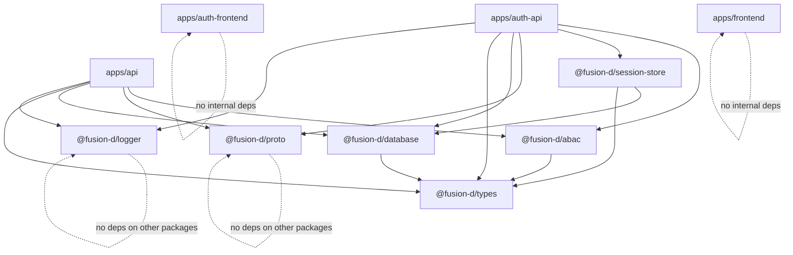
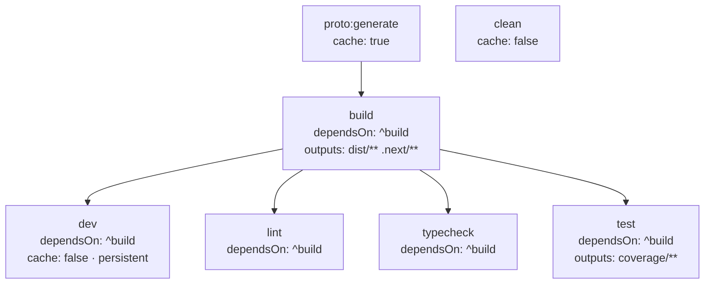

# Monorepo Setup

## Workspace Structure

The monorepo uses **pnpm workspaces** declared in `pnpm-workspace.yaml`:

```yaml
packages:
  - "apps/*"
  - "packages/*"
```

All packages in `apps/` and `packages/` are workspace members. Internal packages reference each other using the `workspace:*` protocol in `package.json`:

```json
"@fusion-d/types": "workspace:*"
```

pnpm resolves `workspace:*` to the local package path at install time and symlinks it under `node_modules/@fusion-d/`. When the workspace is published, `workspace:*` is replaced with the actual version.

### Auth-Relevant Package Dependency Graph



Both frontends (`auth-frontend`, `frontend`) have no internal package dependencies — they are isolated Vite apps that communicate with backends over HTTP.

---

## Turborepo Task Pipeline

Turborepo orchestrates tasks across all workspace packages in dependency order. The pipeline is defined in `turbo.json`.



**`dependsOn: ["^build"]`** means "build all packages that this package depends on before running this task." For example, running `pnpm build` in `apps/auth-api` will first build `@fusion-d/types`, `@fusion-d/database`, `@fusion-d/logger`, `@fusion-d/proto`, `@fusion-d/session-store`, and `@fusion-d/abac` in topological order.

**Why this matters for auth packages:** If you change `packages/types/src/user.ts` and run `pnpm dev` from the root, Turborepo rebuilds `@fusion-d/types` first (in watch mode), then restarts the dependent apps. Without this pipeline, apps would import stale compiled output.

**`cache: false` on `dev` and `clean`:** Development processes are persistent and non-deterministic; caching them would produce incorrect behavior. `clean` always runs fresh to remove all `dist/` directories.

---

## tsup — Shared Package Bundler

Every shared package (`abac`, `session-store`, `proto`, `types`, `logger`, `database`) uses **tsup** to build. The configuration is nearly identical across all packages:

```typescript
// packages/abac/tsup.config.ts (representative example)
export default defineConfig((options) => ({
  entry: ['src/index.ts'],
  format: ['esm'],        // only ESM — no CJS output
  dts: true,              // generate .d.ts declaration files
  clean: !options.watch,  // remove dist/ before build (except in watch mode)
  sourcemap: true,        // inline sourcemaps for debugging
}))
```

**ESM-only output.** All packages in this monorepo are `"type": "module"`. There is no CommonJS output. Node.js ≥20 is required. Any consumer of these packages must use ESM (or a bundler that handles ESM interop).

**`.d.ts` declarations.** `dts: true` ensures TypeScript consumers get full type information from the compiled output without needing to access the source. The `types` field in each `package.json` points to `./dist/index.d.ts`.

**`exports` map.** Each package uses a conditional exports map:

```json
"exports": {
  ".": {
    "import": "./dist/index.js",
    "types": "./dist/index.d.ts"
  }
}
```

This prevents deep imports (`@fusion-d/abac/ability`) — only the public surface exported from `src/index.ts` is accessible.

**`@fusion-d/proto` build exception.** The proto package has a custom build step that copies the `proto/` directory into `dist/proto/` so that `loader.ts` can resolve `auth.proto` at runtime:

```json
"build": "tsup && node -e \"import('fs').then(fs => fs.cpSync('proto', 'dist/proto', { recursive: true }))\""
```

---

## Vite — Frontend Bundler

Both `auth-frontend` and `frontend` use **Vite** with `@vitejs/plugin-react`. The auth-relevant Vite configuration:

```typescript
// apps/auth-frontend/vite.config.ts
export default defineConfig({
  plugins: [react()],
  server: { port: 5174, strictPort: true },
  preview: { port: 5174 },
})
```

`strictPort: true` means Vite will fail to start if port 5174 is already in use, rather than picking a random port. This matters because `VITE_AUTH_FRONTEND_URL` and `VITE_ALLOWED_REDIRECT_ORIGINS` hardcode the port — a port change would silently break redirect validation.

**Environment variables.** Vite exposes only variables prefixed with `VITE_` to the browser bundle. Server-side secrets (like `SESSION_SECRET`) are never accessible in Vite apps. All `VITE_*` values are baked into the static bundle at build time — they are **not** runtime configuration.

---

## Development Startup Order

Starting the full stack requires:

1. `docker compose up -d` — starts MongoDB (:27017, :27018) and Redis (:6379)
2. `pnpm install` — installs and links all workspace packages
3. `pnpm dev` — Turborepo builds all shared packages first, then starts all apps in parallel

The `dev` task uses `tsx` with Node's `--env-file=.env` flag to run TypeScript directly without a separate compilation step, and `--watch` to restart on file changes.

Each app requires its own `.env` file. Copy `.env.example` in each app directory and fill in the secrets before running.
