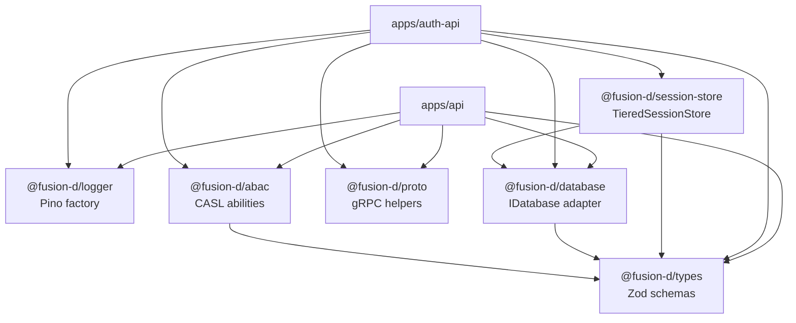

# References

## File-to-Topic Map

| Source file | Documentation topic |
|---|---|
| `apps/auth-api/src/routes/auth.ts` | [Authentication Flows](../authentication/flows.md) — register, login, logout, me, refresh |
| `apps/auth-api/src/middleware/security.ts` | [Authentication Flows](../authentication/flows.md) — security middleware chain, rate limiters |
| `apps/auth-api/src/server.ts` | [Architecture Overview](../architecture/overview.md), [Sessions](../sessions/session-store.md) — express-session config, store construction |
| `apps/auth-api/src/config.ts` | [References](#environment-variables) — auth-api env vars |
| `apps/auth-api/src/grpc/server.ts` | [gRPC Contract](../grpc/contract.md) — ValidateSession and CheckPermission implementations |
| `apps/auth-api/src/index.ts` | Startup and graceful shutdown — not documented separately |
| `apps/api/src/middleware/auth.ts` | [gRPC Contract](../grpc/contract.md) — auth middleware, cookie parsing, req.user attachment |
| `apps/api/src/grpc/client.ts` | [gRPC Contract](../grpc/contract.md) — singleton client, JWT factory |
| `apps/api/src/config.ts` | [References](#environment-variables) — api env vars |
| `apps/auth-frontend/src/pages/Login.tsx` | [Frontend Auth Flows](../frontend-auth/flows.md) — login flow |
| `apps/auth-frontend/src/pages/Register.tsx` | [Frontend Auth Flows](../frontend-auth/flows.md) — register flow |
| `apps/auth-frontend/src/pages/Logout.tsx` | [Frontend Auth Flows](../frontend-auth/flows.md) — logout flow |
| `apps/auth-frontend/src/hooks/useRedirectIfAuthenticated.ts` | [Frontend Auth Flows](../frontend-auth/flows.md) — bounce authenticated users |
| `apps/auth-frontend/src/components/AuthGuard.tsx` | [Frontend Auth Flows](../frontend-auth/flows.md) — available but not wired |
| `apps/auth-frontend/src/utils/redirect.ts` | [Frontend Auth Flows](../frontend-auth/flows.md) — open redirect defense |
| `apps/auth-frontend/src/api.ts` | [Frontend Auth Flows](../frontend-auth/flows.md) — HTTP client for auth-api |
| `apps/auth-frontend/src/App.tsx` | [Frontend Auth Flows](../frontend-auth/flows.md) — route structure |
| `apps/frontend/src/components/AuthGuard.tsx` | [Frontend Auth Flows](../frontend-auth/flows.md) — protect authenticated routes |
| `apps/frontend/src/api.ts` | [Frontend Auth Flows](../frontend-auth/flows.md) — 401 interceptor, redirect to login |
| `packages/proto/proto/auth.proto` | [gRPC Contract](../grpc/contract.md) — service definition |
| `packages/proto/src/client.ts` | [gRPC Contract](../grpc/contract.md) — client factory |
| `packages/proto/src/server.ts` | [gRPC Contract](../grpc/contract.md) — addAuthService, token interceptor |
| `packages/proto/src/loader.ts` | [gRPC Contract](../grpc/contract.md) — proto runtime loading |
| `packages/proto/src/types.ts` | [gRPC Contract](../grpc/contract.md) — hand-maintained TypeScript message types |
| `packages/types/src/user.ts` | [Authentication Flows](../authentication/flows.md) — TUser, TPublicUser, ZRegisterBody, ZLoginBody |
| `packages/types/src/session.ts` | [Sessions](../sessions/session-store.md) — TSession type |
| `packages/abac/src/ability.ts` | [Authorization / ABAC](../authorization/abac.md) — defineAbilityFor, checkPermission, role rules |
| `packages/abac/src/middleware.ts` | [Authorization / ABAC](../authorization/abac.md) — requireAbility middleware factory |
| `packages/session-store/src/tiered-store.ts` | [Sessions](../sessions/session-store.md) — TieredSessionStore, read/write/destroy/touch paths |
| `packages/session-store/src/layers/memory.ts` | [Sessions](../sessions/session-store.md) — L1 MemoryLayer (lru-cache) |
| `packages/session-store/src/layers/redis.ts` | [Sessions](../sessions/session-store.md) — L2 RedisLayer (ioredis), degradation |
| `packages/session-store/src/layers/db.ts` | [Sessions](../sessions/session-store.md) — L3 DbLayer (IDatabase) |
| `packages/database/src/interface.ts` | [Integration Guide](../integration/guide.md) — IDatabase contract |
| `turbo.json` | [Monorepo Setup](../monorepo/setup.md) — task pipeline |
| `pnpm-workspace.yaml` | [Monorepo Setup](../monorepo/setup.md) — workspace members |
| `packages/*/tsup.config.ts` | [Monorepo Setup](../monorepo/setup.md) — tsup configuration |
| `apps/auth-frontend/vite.config.ts` | [Monorepo Setup](../monorepo/setup.md) — Vite config |

---

## Internal Package Dependency Graph (Auth-Relevant)

---

## Environment Variables

### auth-api (`apps/auth-api/.env.example`)

| Variable | Required | Default | Description |
|---|---|---|---|
| `NODE_ENV` | No | `development` | `development`, `production`, or `test` |
| `PORT` | No | `4001` | HTTP server port |
| `GRPC_PORT` | No | `50051` | gRPC server port |
| `SESSION_SECRET` | **Yes** | — | Min 64 chars. Generate: `openssl rand -hex 64` |
| `SESSION_TTL_SECONDS` | No | `86400` | Session lifetime in seconds (24 h) |
| `SESSION_COOKIE_NAME` | No | `sid` | Name of the session cookie |
| `DB_TYPE` | No | `lowdb` | `lowdb` or `mongo` |
| `LOWDB_PATH` | No | `./data/auth.json` | LowDB file path (used when `DB_TYPE=lowdb`) |
| `MONGO_URI` | Conditional | — | Required when `DB_TYPE=mongo` |
| `REDIS_URL` | No | `redis://:redispassword@localhost:6379` | Redis connection URL |
| `SERVICE_JWT_SECRET` | **Yes** | — | Min 32 chars. Must match `api`. `openssl rand -hex 32` |
| `ALLOWED_CORS_ORIGINS` | No | `http://localhost:5173,http://localhost:5174` | Comma-separated list of allowed origins |
| `LOG_LEVEL` | No | `info` | Pino log level |

### api (`apps/api/.env.example`)

| Variable | Required | Default | Description |
|---|---|---|---|
| `NODE_ENV` | No | `development` | `development`, `production`, or `test` |
| `PORT` | No | `4000` | HTTP server port |
| `DB_TYPE` | No | `lowdb` | `lowdb` or `mongo` |
| `LOWDB_PATH` | No | `./data/api.json` | LowDB file path |
| `MONGO_URI` | Conditional | — | Required when `DB_TYPE=mongo` |
| `AUTH_API_GRPC_ADDRESS` | No | `localhost:50051` | gRPC address of auth-api |
| `SERVICE_JWT_SECRET` | **Yes** | — | Must match `auth-api` |
| `ALLOWED_CORS_ORIGINS` | No | `http://localhost:5173` | Comma-separated list |
| `LOG_LEVEL` | No | `info` | Pino log level |

### frontend (`apps/frontend/.env.example`)

| Variable | Required | Description |
|---|---|---|
| `VITE_API_URL` | **Yes** | Base URL of the `api` service, e.g. `http://localhost:4000` |
| `VITE_AUTH_API_URL` | **Yes** | Base URL of `auth-api`, e.g. `http://localhost:4001` |
| `VITE_AUTH_FRONTEND_URL` | **Yes** | Base URL of `auth-frontend`, e.g. `http://localhost:5174` |

### auth-frontend (no `.env.example` — derived from source)

> These variables were identified from source code. No `.env.example` file exists for `auth-frontend`.

| Variable | Required | Description |
|---|---|---|
| `VITE_AUTH_API_URL` | **Yes** | Base URL of `auth-api`, e.g. `http://localhost:4001` |
| `VITE_ALLOWED_REDIRECT_ORIGINS` | **Yes** | Comma-separated allowed redirect origins, e.g. `http://localhost:5173`. Empty = block all absolute redirects |
| `VITE_AUTH_FRONTEND_URL` | **Yes** | This app's own origin, used by `buildLoginUrl()` |
| `VITE_DEFAULT_REDIRECT_URL` | No | Fallback redirect destination after login/register when no `?redirect` param is present |

---

## Library Versions

| Library | Version | Used by |
|---|---|---|
| `express` | `^5.2.1` | `auth-api`, `api` |
| `argon2` | `^0.41.1` | `auth-api` — password hashing |
| `express-session` | `^1.18.1` | `auth-api`, `@fusion-d/session-store` |
| `express-rate-limit` | `^7.5.0` | `auth-api` |
| `helmet` | `^8.0.0` | `auth-api` |
| `cors` | `^2.8.5` | `auth-api`, `api` |
| `jsonwebtoken` | `^9.0.2` | `auth-api` (gRPC token verify), `api` (gRPC token sign) |
| `@grpc/grpc-js` | `^1.12.5` | `auth-api`, `api`, `@fusion-d/proto` |
| `@grpc/proto-loader` | `^0.7.15` | `@fusion-d/proto` |
| `@casl/ability` | `^6.7.3` | `@fusion-d/abac` |
| `ioredis` | `^5.4.2` | `@fusion-d/session-store` |
| `lru-cache` | `^11.0.2` | `@fusion-d/session-store` |
| `zod` | `^3.23.8` | `@fusion-d/types`, `auth-api` config, `api` config |
| `pino` | `^9.5.0` | `@fusion-d/logger` |
| `mongoose` | `^8.9.0` | `auth-api`, `api` (MongoDB adapter) |
| `cookie-parser` | `^1.4.7` | `api` — parses `Cookie` header for session ID extraction |
| `react` | `^18.3.1` | `auth-frontend`, `frontend` |
| `@tanstack/react-query` | `^5.62.16` | `auth-frontend`, `frontend` |
| `react-router-dom` | `^6.28.1` | `auth-frontend` |
| `vite` | `^6.0.11` | `auth-frontend`, `frontend` |
| `tsup` | `^8.3.5` | all shared packages |
| `typescript` | `^5.7.3` | all packages |
| `turbo` | `^2.3.3` | root |
| `pnpm` | `9.15.0` | root (packageManager) |
| `node` | `>=20` | all (engine requirement) |
