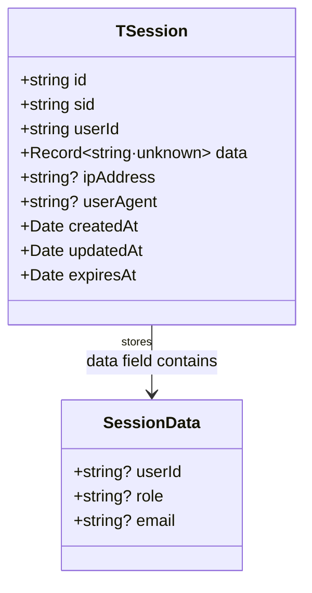
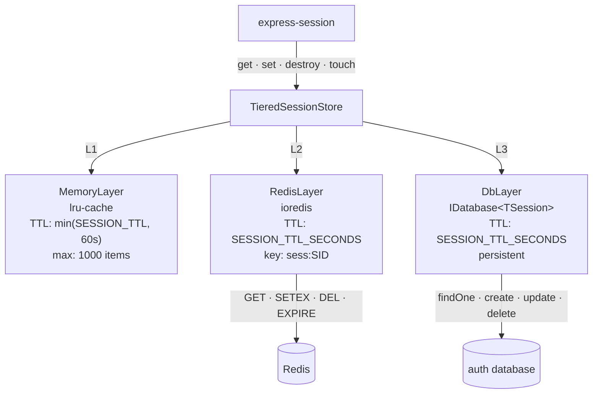
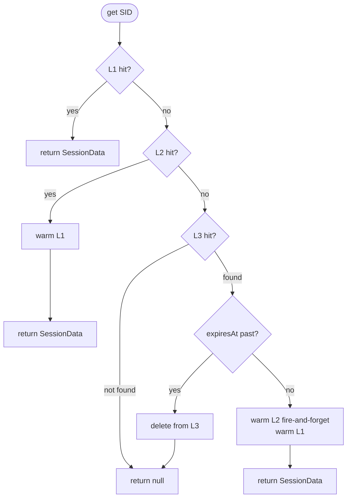
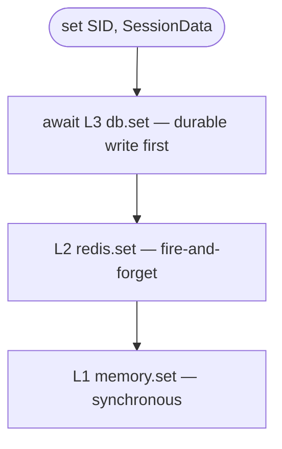

# Session Store

## express-session Configuration

`auth-api` mounts `express-session` in `apps/auth-api/src/server.ts` with a custom store:

```typescript
session({
  name: config.SESSION_COOKIE_NAME,      // default: 'sid'
  secret: config.SESSION_SECRET,          // min 64 chars, used to sign cookie HMAC
  store,                                  // TieredSessionStore
  resave: false,                          // do not re-save unchanged sessions
  saveUninitialized: false,               // do not create sessions for unauthenticated requests
  rolling: true,                          // reset maxAge on every response
  cookie: {
    httpOnly: true,
    secure: config.NODE_ENV === 'production',
    sameSite: 'strict',
    maxAge: config.SESSION_TTL_SECONDS * 1000,  // default: 86 400 000 ms (24 h)
  },
})
```

`saveUninitialized: false` is important for performance: anonymous requests (the login page itself, health checks) do not create session records. A session is only created and persisted after `session.regenerate()` is called in the login or register handler.

The cookie value written to the browser is `s:SID.HMAC` where `SID` is the raw session identifier and `HMAC` is an HMAC-SHA256 signature computed from `SESSION_SECRET`. The raw `SID` is what gets stored as the key in all three store layers.

---

## Session Type



`TSession` is the database record (`packages/types/src/session.ts`). The `data` field holds the `express-session` `SessionData` object, which is augmented with `userId`, `role`, and `email` by the auth routes (`apps/auth-api/src/routes/auth.ts:10–16`).

---

## Tiered Store Architecture



`TieredSessionStore` extends `express-session`'s `Store` class. The three layers are injected via constructor; only the `MemoryLayer` is synchronous — `RedisLayer` and `DbLayer` are async.

---

## Read Path



L1 is an in-process LRU cache — a hit has zero network overhead and completes in microseconds. L2 (Redis) is checked on an L1 miss; a hit warms L1 and returns. L3 (database) is the authoritative source; a hit warms both L2 and L1.

Expiry is enforced at L3: `DbLayer.get()` checks `expiresAt` and deletes stale records before returning `null`. Redis relies on native TTL (`SETEX`). L1 relies on lru-cache's per-item TTL.

---

## Write Path



L3 is always written first and awaited. L2 and L1 are best-effort: if Redis is unavailable, the session is still durably stored in the database. The in-memory set is synchronous and never fails.

---

## Destroy Path

When `session.destroy()` is called (on logout):

1. `MemoryLayer.delete(sid)` — synchronous, immediate.
2. `Promise.allSettled([redis.delete(sid), db.delete(sid)])` — both run concurrently; errors are suppressed so a Redis failure does not prevent DB cleanup.

---

## Touch Path (TTL Extension)

`session.touch()` is called explicitly by `POST /auth/refresh`, and implicitly by `express-session` on every response when `rolling: true`:

1. `redis.touch(sid, ttl)` — fire-and-forget; calls Redis `EXPIRE`.
2. `await db.touch(sid, ttl)` — updates the `expiresAt` field in the database.

L1 TTL is not explicitly extended because L1 entries are short-lived (≤60 s) and will be re-warmed from L2/L3 on the next read.

---

## Redis Degradation

`RedisLayer` is configured with:

```typescript
new Redis(redisUrl, {
  lazyConnect: true,          // does not connect until .connect() is called
  enableOfflineQueue: false,  // commands fail immediately if disconnected
  maxRetriesPerRequest: 1,    // one retry per command before failing
})
```

All `RedisLayer` methods catch errors silently. If Redis is unavailable during startup, `auth-api` logs a warning and continues (`apps/auth-api/src/server.ts:61–63`). The session store degrades to L1 + L3 only: read latency increases on L1 misses, but sessions remain fully functional.

> **Security:** Redis stores session data as JSON under the key `sess:SID`. Access to Redis must be restricted at the network level; there is no application-level encryption of the session payload in Redis.

---

## Layer Summary

| Layer | Implementation | TTL | Survives restart | Survives Redis outage |
|---|---|---|---|---|
| L1 Memory | `lru-cache` | ≤60 s | No | Yes |
| L2 Redis | `ioredis` | `SESSION_TTL_SECONDS` (24 h) | Yes (Redis persistence) | No |
| L3 DB | `IDatabase<TSession>` | `SESSION_TTL_SECONDS` (24 h) | Yes | Yes |
